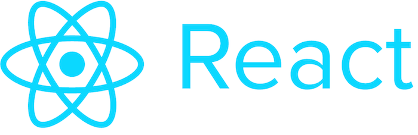
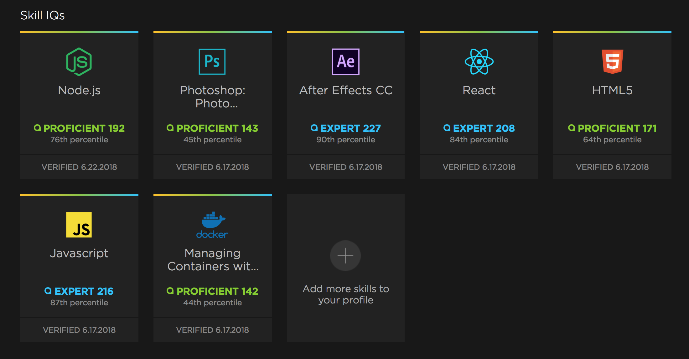

# Ton XP / Niveau en React ?

Si je devais exprimer mon "niveau" en **React**, je dirais que je suis confirmé. Mais étant donné la subjectivité qu'il y a derrière cette auto-évaluation, je pense qu'un résumé de l'expérience que j'ai avec cette technologie peut vous être plus utile.

### Premiers contacts avec React

> **React** a été pour moi un coup de foudre depuis que je l'ai découvert il y a environ 3 ans. 
>J'ai suivi beaucoup de cours en ligne sur *Udemy* pour le comprendre en profondeur, tout en continuant d'explorer et de découvrir **MeteorJS** pour le backend (un framework **NodeJS**). 
>
> Au delà de **React**, j'essayais d'apprendre comment il pouvait s'intégrer dans cet environnement Full Stack, tout en essayant parrallèlement de l'intégrer avec **Redux**, que je découvrais également. 

### Création d'une formation fullStack JS

> Missionné par Simplon pour créer et animer un formation à distance, j'ai saisi cette opportunité pour explorer plus encore **React**, mais aussi **Redux, Node** et **Meteor**, et plus généralement le javascript. 
>
> J'ai du créer des cours et des exercices autour ce ces notions, ce qui est une excellente façon d'apprendre. Pour expliquer il faut déjà soi même bien comprendre. 

Ce que je retire vraiment de cette experience finalement, c'est surtout la bien meilleure vision d'ensemble de tous ces outils javascript, des liens qui les unissent, et surtout de leur potentiel.

### Création d'un Dashboard Apprenant

> Pendant que je préparais cette formation, je m'étais fabriqué un playground, dans lequel j'essayais de développer et tester fonctionnalités et  composants. 
>
> J'ai décidé d'en réutiliser certains, en me lançant dans un projet personnel: un dashboard apprenants / formateur qui permettait à un formateur de partager des ressources rédigées sur github, ainsi qu' une interface pour les étudiants.
>
> Ces derniers retouvaient la liste des contenus postés par le formateur, puis lors de l'affichage d'une ressource, via l'**api de github**, un composant récupérait le **markdown** pour afficher le cours dans l'interface, en générant automatiquement un menu avec arborescence des chapitres du cours (en analysant les titres et sous titres).
>
> Ce dashboard a été testé et utilisé avec deux promotions **Wordpress** par Simplon.

### Création de la plateforme d'apprentissage de Simplon

> Suite à ce projet, Simplon m'a proposé d'être le repsonsable technique du développement de leur plateforme d'apprentissage. J'ai pu être assisté pour cette mission par un développeur que j'ai formé précédemment dans la classe à distance full stack.
>
> D'une durée d'environ un an et demi, ce projet m'a évidemment permis de consolider ma comprehension des différentes technologies utilisées, mais j'ai pu surtout progresser dans la structuration de projets plus volumineux et complexes.
>
> Parmi les fonctionnalités développées :
> * Création / administration de compétences
> * Création / administration de référentiels de compétences
> * Création / administration de classes liées à un référentiel
> * Création / administration de ressources
> * Création / administration de briefs (projets)
> * Profil apprenant
> * Favoris
> * Like / dislike / partage dans une promo de resources et briefs
> * Système de validation par les pairs
> * Système de notifications
> * Liens avec API Discord pour automatiser les inscriptions
> * Bot
> * ...
### Depuis

> J'en apprend encore tous les jours sur React et les technos qui gravitent autour, et j'ai peu eu à explorer certains gros pans comme **Babel** ou **Grunt / Gulp** puisque les environnements de développement que j'utilise (**meteor** ou **create-react-app**) automatisent l'utilisation de l'ES6 et le process de build.
>
> J'ai par contre par curiosité personnelle pu me plonger dans les tests avec **Jest**, ou explorer **React Native**, ou du **React** simple dans une application **Electron**.

Si cela a une quelquonque valeur pour vous, j'ai également passé quelques tests sur pluralsight, avant tout à des fins d'auto-évaluation.

https://app.pluralsight.com/profile/tonytiratay

# Ta motivation à rejoindre O'clock

> Ça sonne un peu comme une évidence pour moi. Si nous avons l'occasion de parler plus en détail de mon parcours, vous verrez que **l'éducation par le numérique est au coeur de mon identité professionnelle**, et personnelle. 
>
> Lorsque j'ai parcouru votre site, le programme, la méthode, la philosophie en général, j'ai eu le sentiment que j'aurais pu écrire moi même ces mots... En moins bien bien sûr ;) ! 
>
> Ça, c'est pour votre philosphie côté apprenant. Concernant votre politique de travail, pour ce que j'ai pu lire dans vos fiches de poste, je m'y retrouve également à 100%.
>
> J'apprécie le fait que le temps de travail soit réparti entre formation / accompagnement des apprenants, et amélioration / création de contenus et de solutions pour votre plateforme.
>
> **C'est ce autour de quoi je gravite depuis les débuts de ma carrière professionnelle**, et O'clock est pour moi une sorte de quintescence de ce que j'ai pu apprendre au cours de cette dernière dizaine d'années. Je reconnais l'experience derrière vos mots, j'adorerais évoluer avec vous, pour apprendre de votre experience, et également partager la mienne.

